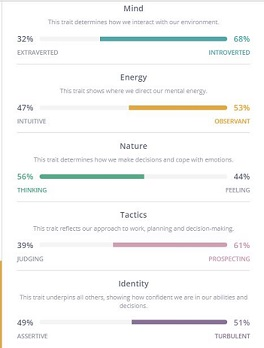
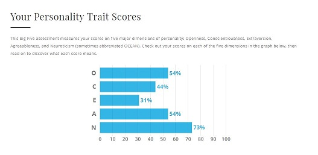

<h1 style="color:blue;font-family:algerian">My Profile</h1>

 

Name: Jade Gower

Email: IloveIT@hotmail.com

Student #:123456789

<h2 style="color:blue;">Background</h2>

My name is Jade, and I have a keen interest in IT, specifically in security. 

I grew up in a time where computers and the internet were only just getting off the ground. It was in my teens that I developed a love for the internet and all its components. 
I completed my year 10 school certificate in 2000 and recently completed Cert II in IT at my local Tafe.
I have grown to enjoy baking and decorating cakes as a hobby for my family. Their requests for birthday cakes have gotten more extravagant as the years pass!

<h2 style="color:blue;">Interests in IT</h2>

It was only in recent years that I discovered that I had a knack for computers/IT. At the same time, I found that I enjoyed finding faults in tech gadgets and in online games. 

I feel that IT is the future in all aspects from Schooling to the Medical world to the political world. By jumping on board now, I can be secure in the knowledge that there will always be work for me.

I found RMIT through OUA and I decided to go through them because of their Cyber Security course. I thought they offered a great course and I’m currently completing more courses in the lead up to the cyber security course later this year.

I hope to broaden my IT knowledge by stepping out of my comfort zone and diving into my studies.

<h2 style="color:blue;">Ideal job</h2>

<h2>IT Security Advisor</h2>

<a href="https://www.seek.com.au/job/39220732?type=standout&searchrequesttoken=cab2d589-b2d2-481c-bc46-63e108c7e34a">Seek.com.au</a>
  

  

This is an advertisement for an IT security advisor in ACT.
The job entails you to have experience with security documents, knowledge of PSPF and knowledge of ISM with certification being beneficial in one of the following-CISSP, CISM or CISA.

You would be required to help improve the organisations overall security for a team of technical staff to implement the new policies.
I currently do not have the entry requirements for this job but if I were to go for it, I would look at completing my Bachelor of IT, also gain certification in CISA at a minimum.
I would try and gain employment in an IT specific workplace to help gain experience in the IT sector. 

<h2 style="color:blue;">Personal profile</h2>
   

<a href="url">https://www.16personalities.com/</a>

<a href="url">https://www.truity.com/test/big-five-personality-test</a>

Looking at these results it shows that while I am quiet and reserved, I use logic and rational thinking when making decisions.
When forming a group, I do need to look for an assertive leader. Someone who is more extroverted and can fill that role. If I can’t, I need to step up and be the one to take the leadership role.

<h1 style="color:blue;">Project Idea</h1>

<h2 style="color:blue;">Overview-</h2>

My idea is to build a wireless hub and link our phones, link a key fob, or anything you can attach a wireless chip to, so when we need to find our device, we can hit the corresponding button and it’ll beep. We’re forever losing our devices and such, and here is the answer to finding them.

<h2 style="color:blue;">Motivation-</h2>

According to a 2017 study based on 2005 subjects by <a href="https://www.finder.com.au/press-release-australians-have-blown-755-million-on-replacements">Finder.com.au</a>, it showed that 6% of the subjects lost their phones in the previous 5yrs.
On average, there are 1370 smartphones being lost or destroyed by Australians every day, which are being replaced at a tune of $755 million. 
A 2017 study conducted by Bluetooth tracker company <a href="https://www.techly.com.au/2017/11/29/time-money-study-reveals-australians-lose-stuff-lot-costs-tonnes/">Tile</a>, shows that lost items have cost Australians $1.2Billion in the previous year alone.

<h2 style="color:blue;">Description</h2>

A small security chip can be stuck to the back of your phone. A key fob with the chip inside that can be attached to your keyring.
You can find your item through a small device that can be hung on the wall or sat on a bench where you can talk to it. 
The hub would only need to be 10 x 8 (or bigger sizes can be made if need be) The hub can be run on batteries or plugged in with a charging cord. 
The hub can be woken up by pressing the on/off button then clicking one of the previously synced buttons to find your specific item. 

<h2 style="color:blue;">Outcome</h2>

If this project were successful, the outcome would be beneficial to a lot of people. 
We live busy lives and while we’re busy, we lose important things. By using this tracker, we can cut down on the lost time that we spend looking for them. 
As long as the hub remains in the one place, connected to a charging source, there would be no need to worry about not finding lost items. 

